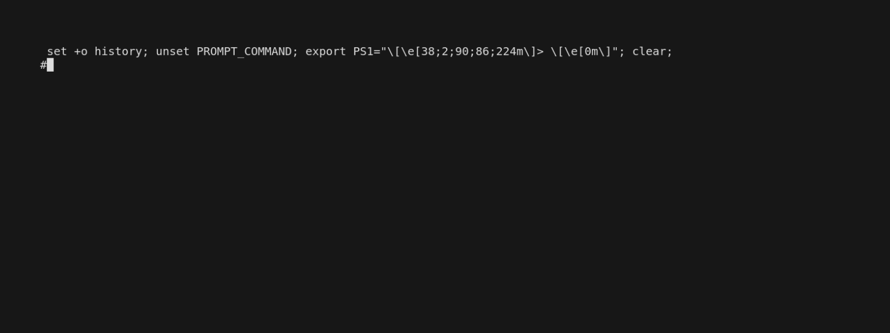

# qenerate

`qenerate` is a pluggable code generator for GraphQL Query and Fragment Data Classes.
It works hand in hand with GraphQL clients like [gql](https://github.com/graphql-python/gql).
Clients like gql return nested untyped dictionaries as result to a query.
`qenerate` generated classes easily transform these nested untyped dictionaries into concrete classes.
`qenerate` itself is not a GraphQL client and solely focuses on generating code
for transforming untyped dictionaries into concrete types.

## Installation

[Releases](https://pypi.org/project/qenerate/) are published on pypi.

```sh
pip install qenerate
```

## Usage

### Introspection



In a first step we must obtain the GQL schema in the form of an introspection query:

```sh
qenerate introspection http://my-gql-instance:4000/graphql > introspection.json
```

The `introspection.json` is used in a next step to map concrete types to your queries and fragments.

### Code Generation

```sh
qenerate code -i introspection.json dir/to/gql/files
```

An `introspection.json` and a (nested) directory holding all your `*.gql` files are given.
`qenerate` then generates data classes for every `*.gql` file it encounters
while traversing the given directory.

`qenerate` expects that a `.gql` file contains exactly one `query`, `mutation` or `fragment` definition.

Note, that the given directory and every `gql.` file in it share the same scope.
I.e., within this scope fragment and query names must be unique. Further, you can
freely use any fragment within queries, as long as the fragment is defined somewhere
within the scope (directory).

#### Example for Single Query

[Single query](demo/gql/queries/example1.gql) and its [generated classes](demo/gql/queries/example1.py).


#### Example for Query using a Fragment

We define a re-usable [fragment](demo/gql/fragments/fragment1.gql) which results in the following
generated [re-usable data classes](demo/gql/fragments/fragment1.py).

The fragment is used in a [query](demo/gql/queries/example2.gql) and imported
in the [generated python file](demo/gql/queries/example2.py).


#### More Examples

`qenerate` is actively used in our qontract-reconcile project. There you can find a lot of [examples](https://github.com/app-sre/qontract-reconcile/tree/master/reconcile/gql_definitions) on how generated classes look like in more detail.

## Plugins

`qenerate` follows a plugin based approach. I.e., multiple code generators are supported.
Choosing a code generator is done inside the query file, e.g., the following example will
generate data classes using the `pydantic_v1` plugin:

```graphql
# qenerate: plugin=pydantic_v1
query {
    ...
}
```

By choosing a plugin based approach, `qenerate` can extent its feature set creating new plugins
while at the same time keeping existing plugins stable and fully backwards compatible.

Currently available plugins are:

- [pydantic_v1](docs/plugins/pydantic_v1.md) for generating [Pydantic](https://docs.pydantic.dev/) data classes

## Feature Flags

`qenerate` leverages feature flags to configure the behavior of the generator. Feature flags are passed to
the generator via comments in your .gql definition file.

### Plugin

```graphql
# qenerate: plugin=<plugin-id>
```

This feature flag tells `qenerate` which plugin it should use to generate the code for the given definition.

### Custom Type Mapping

You can tell qenerate to map a primitive GQL type (a.k.a. Scalar) to something that you want. This can be handy if your codebase expects other primitive datatypes like, e.g., `str` instead of `Json` or `datetime`. This can be especially useful for custom GQL primitives.

```graphql
# qenerate: map_gql_scalar=JSON -> str
```

The above will tell qenerate to map the GQL `JSON` type to `str` instead of pydantic's `Json`. You can also map multiple types, e.g.,

```graphql
# qenerate: map_gql_scalar=JSON -> str
# qenerate: map_gql_scalar=DateTime -> str
```

### Naming Collision Strategy

```graphql
# qenerate: naming_collision_strategy=[PARENT_CONTEXT | ENUMERATE]
```

This feature flag tells `qenerate` how to deal with naming collisions in classes.
In GraphQL it is easy to query the same object in a nested fashion, which results
in re-definitions of the type. We call this naming collision. A naming collision
strategy defines how to adjust recurring names to make them unique.

**PARENT_CONTEXT**

This is the default strategy if nothing else is specified. It uses the name of the
parent node in the query as a prefix.

**ENUMERATE**

This strategy adds the number of occurrences of this name as a suffix.

However, in most cases it might be cleaner to define a re-usable fragment instead of
relying on a collision strategy. Here are some [fragment examples](https://github.com/app-sre/qontract-reconcile/tree/master/reconcile/gql_definitions/fragments).

## Limitations

### Overlapping properties

As of now `qenerate` does not support operations with overlapping properties. E.g.,

```graphql
fragment MyFragment on Namespace {
    b {
        e
        f
    }
}

query MyQuery {
    namespaces {
        a
        ... MyFragment
        b {
            c  # This overlapps with properties in MyFragment
        }
    }
}
```

The above is valid GQL syntax and will merge properties defined in `MyFragment` and `b { c }` into `b {c,e,f}`.
However, currently `qenerate` will fail to deduce proper base classes for these overlapps.
Work on this is being conducted in [#77](https://github.com/app-sre/qenerate/pull/77).

## Development

### CI

CI happens on an [app-sre](https://github.com/app-sre/) owned Jenkins instance.

- [Releases](https://ci.ext.devshift.net/job/app-sre-qenerate-gh-build-main/)
- [PR Checks](https://ci.ext.devshift.net/job/app-sre-qenerate-gh-pr-check/)

### Build and Dependency Management

`qenerate` uses [poetry](https://python-poetry.org/docs/) as build and dependency management system.

### Formatting

`qenerate` uses [ruff](https://docs.astral.sh/ruff/) for code checking and formatting.

### Generating setup.py

```sh
pip install poetry2setup
poetry2setup .
```

### Architecture

The architecture is described in more detail in [this document](docs/architecture.md).
